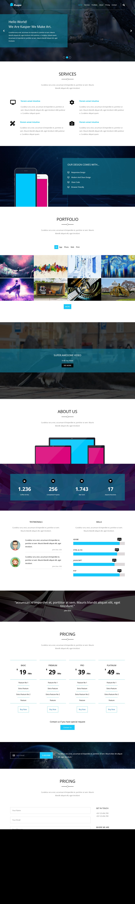
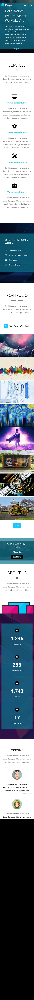

# Zero Web School - Template #02 - Kasper

This is my solution to the [[Kasper Template Challenge on Zero Web School]](https://www.youtube.com/playlist?list=PLDoPjvoNmBAy1l-2A21ng3gxEyocruT0t).

## Table of contents

-   [Screenshots](#Screenshots)
-   [Links](#Links)
-   [Built with](#Built-with)
-   [Author](#author)

### Screenshots

Desktop

Mobile

### Links

-   [Solution URL](https://github.com/MuhammadM1998/ZWS-Template02)
-   [Live Site URL](https://muhammadm1998.github.io/ZWS-Template02/)

### Built with

-   HTML5
-   CSS
-   CSS Grid
-   CSS Flexbox
-   Desktop-First Design

## Author

-   GitHub - [@MuhammadM1998](https://github.com/MuhammadM1998)
-   Zero Web School - [@Youtube](https://www.youtube.com/c/ElzeroInfo)
